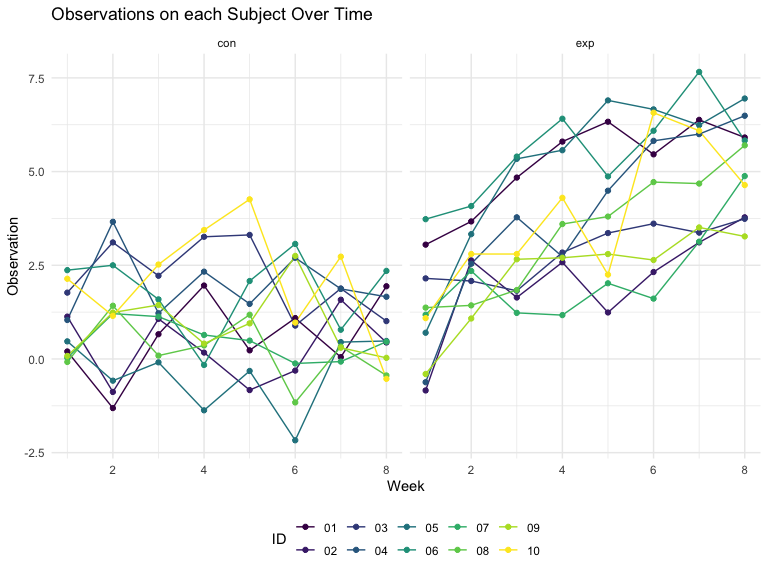
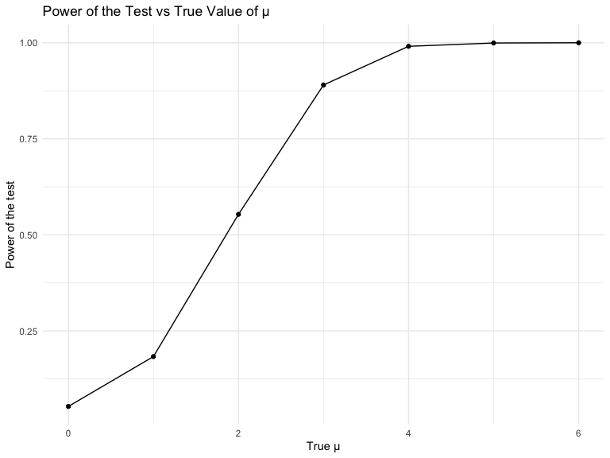
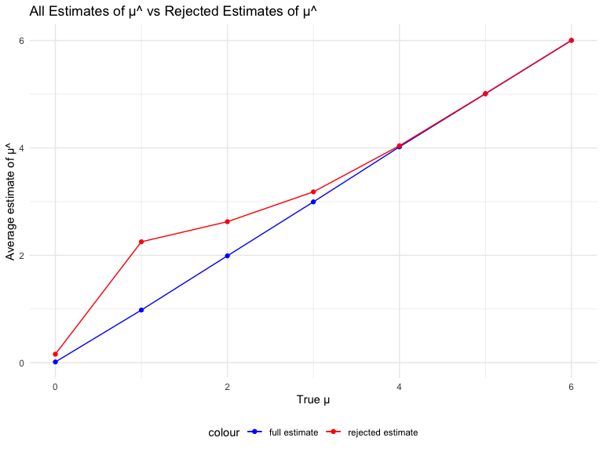

Homework 5
================
Shina Min
11.14.2023

``` r
library(tidyverse)
```

## Problem 1

For this problem, we are interested in data gathered and made public by
*The Washington Post* on homicides in 50 large U.S. cities. The code
chunk below imports and cleans the data.

``` r
homicide_df = 
  read_csv("data-homicides-master/homicide-data.csv", na = c("", "NA", "Unknown")) %>%
  mutate(
    city_state = str_c(city, state, sep = ", "),
    resolution = case_when(
      disposition == "Closed without arrest" ~ "unsolved",
      disposition == "Open/No arrest"        ~ "unsolved",
      disposition == "Closed by arrest"      ~ "solved"
    )
  ) %>% 
  filter(city_state != "Tulsa, AL") 
```

    ## Rows: 52179 Columns: 12
    ## ── Column specification ────────────────────────────────────────────────────────
    ## Delimiter: ","
    ## chr (8): uid, victim_last, victim_first, victim_race, victim_sex, city, stat...
    ## dbl (4): reported_date, victim_age, lat, lon
    ## 
    ## ℹ Use `spec()` to retrieve the full column specification for this data.
    ## ℹ Specify the column types or set `show_col_types = FALSE` to quiet this message.

The resulting dataframe has 52178 entries, on variables that include the
victim name, race, age, and sex; the date the homicide was reported; and
the location of the homicide. In cleaning, I created a `city_state`
variable that includes both city and state, and a `resolution` variable
to indicate whether the case was closed by arrest. I also excluded one
entry in Tulsa, AL, which is not a major US city and is most likely a
data entry error.

In the next code chunk, I group within cities and summarize to produce
the total number of homicides and the number that are solved.

``` r
city_homicide_df = 
  homicide_df %>% 
  select(city_state, disposition, resolution) %>% 
  group_by(city_state) %>% 
  summarize(
    hom_total = n(),
    hom_unsolved = sum(resolution == "unsolved"))
```

Focusing only on Baltimore, MD, I can use the `prop.test` and
`broom::tidy` functions to obtain an estimate and CI of the proportion
of unsolved homicides in that city. The table below shows those values.

``` r
bmore_test = 
  prop.test(
    x = filter(city_homicide_df, city_state == "Baltimore, MD") %>% pull(hom_unsolved),
    n = filter(city_homicide_df, city_state == "Baltimore, MD") %>% pull(hom_total)) 

broom::tidy(bmore_test) %>% 
  knitr::kable(digits = 3)
```

| estimate | statistic | p.value | parameter | conf.low | conf.high | method                                               | alternative |
|---------:|----------:|--------:|----------:|---------:|----------:|:-----------------------------------------------------|:------------|
|    0.646 |   239.011 |       0 |         1 |    0.628 |     0.663 | 1-sample proportions test with continuity correction | two.sided   |

Building on this code, I can use functions in the `purrr` package to
obtain estimates and CIs for the proportion of unsolved homicides in
each city in my dataset. The code below implements this analysis.

``` r
test_results = 
  city_homicide_df %>% 
  mutate(
    prop_tests = map2(hom_unsolved, hom_total, \(x, y) prop.test(x = x, n = y)),
    tidy_tests = map(prop_tests, broom::tidy)) %>% 
  select(-prop_tests) %>% 
  unnest(tidy_tests) %>% 
  select(city_state, estimate, conf.low, conf.high) %>% 
  mutate(city_state = fct_reorder(city_state, estimate))
```

Finally, I make a plot showing the estimate (and CI) of the proportion
of unsolved homicides in each city.

``` r
test_results %>% 
  mutate(city_state = fct_reorder(city_state, estimate)) %>% 
  ggplot(aes(x = city_state, y = estimate)) + 
  geom_point() + 
  geom_errorbar(aes(ymin = conf.low, ymax = conf.high)) + 
  theme(axis.text.x = element_text(angle = 90, hjust = 1))
```


This figure suggests a very wide range in the rate at which homicides
are solved – Chicago is noticeably high and, given the narrowness of the
CI, likely is the location of many homicides.

## Problem 2

## Loading all the necessary packages

    ## 
    ## Attaching package: 'rvest'

    ## The following object is masked from 'package:readr':
    ## 
    ##     guess_encoding

## A dataframe containing all file names using list.files function

``` r
comb_df = 
  tibble(
    files = list.files("data/"),
    path = str_c("data/", files)
  ) %>% 
  mutate(data = map(path, read_csv)) %>%
  unnest()
```

## Iterating over file names and read in data for each subject using purrr::map and saving the result as a new variable in the dataframe

``` r
tidy_df = comb_df %>% 
  mutate(
    files = str_replace(files, ".csv", ""),
    group = str_sub(files, 1, 3),
    ID = str_sub(files, 5, 7)) %>%
  pivot_longer(week_1:week_8,names_to = "week", values_to = "observation",names_prefix = "week_") %>%
  mutate(week = as.numeric(week)) %>%
  select(group, ID, week, observation)
```

## Making a spaghetti plot showing observations on each subject over time, and comment on differences between groups.

``` r
spagetti_plot = tidy_df %>%
  ggplot(aes(x = week, y = observation, color = ID)) +
  geom_line() +
  geom_point() + 
  facet_grid(~group) +
  labs(x = 'Week', y = 'Observation', title = 'Observations on each Subject Over Time')

spagetti_plot
```



- In the control group, observations for each subject consistently hover
  around a stable value, whereas in the experimental group, there is a
  discernible trend of increasing observations among subjects as the
  weeks unfold.

## Problem 3

## Loading the samples

``` r
set.seed(12345)
n = 30
sigma = 5
alpha = 0.05
simulations = 5000
```

## The function below generates 5000 datasets from the model at mu = 0, with the above parameters.

``` r
sim_test = function(mu){

  sim_data = tibble(rnorm(n = 30, mean = mu, sd = 5))

  sim_data %>%
    t.test() %>% 
    broom::tidy() %>% 
    select(estimate, p.value)
}

sim_results = 
  expand_grid(
    mu = 0,
    iter = 1:5000) %>% 
  mutate(t_test_df = map(mu, sim_test)) %>% 
  unnest(t_test_df)
```

## The table below generates 5000 datasets from the model at mu = 1, 2, 3, 4, 5, 6, with the above parameters.

``` r
sim_results_2 =
  expand_grid(
    mu = 0:6,
    iter = 1:5000) %>%
  mutate(t_test_df_2 = map(mu, sim_test)) %>%
  unnest(t_test_df_2)
```

- This plot illustrates the proportion of instances where the null
  hypothesis was rejected (indicating the test’s power) on the y-axis,
  with the true value of μ on the x-axis. The plot highlights a
  proportional relationship between effect size and power: as the true
  value of μ rises, the test’s power also increases.

## Making a plot showing the proportion of times the null was rejected (the power of the test) on the y axis and the true value of μ on the x axis.

``` r
sim_results_2 |> 
  group_by(mu) |> 
  summarize(proportion_rejected = sum(p.value < 0.05)/5000) |> 
  ggplot(aes(x = mu, y = proportion_rejected)) +
  geom_point() +
  geom_line() +
  labs(
    title = "Power of the Test vs True Value of μ",
       x = "True μ",
       y = "Power of the test")
```



- The plot depicted here illustrates the mean estimate of μ-hat on the
  y-axis against the true value of μ on the x-axis. The second plot,
  overlaid on the first, specifically portrays the mean estimate of
  μ-hat in samples where the null hypothesis was rejected on the y-axis,
  with the true value of μ on the x-axis.

## showing the average estimate of μ̂ on the y axis and the true value of μ on the x axis

``` r
avg_estimate = 
  sim_results_2 |> 
  group_by(mu) |> 
  summarize(average_estimate = mean(estimate)) |> 
  ungroup()

avg_rejected_estimate = 
  sim_results_2 |> 
  group_by(mu) |> 
  filter(p.value < 0.05) |> 
  summarize(average_estimate = mean(estimate)) |> 
  ungroup()
```

## Make a plot showing the average estimate of μ̂ on the y axis and the true value of μ on the x axis. Make a second plot (or overlay on the first) the average estimate of μ̂ only in samples for which the null was rejected on the y axis and the true value of μ on the x axis.

``` r
ggplot() +
  geom_line(data = avg_estimate, aes(x = mu, y = average_estimate, color = "full estimate")) +
  geom_line(data = avg_rejected_estimate, aes(x = mu, y = average_estimate, color = "rejected estimate")) +
  geom_point(data = avg_estimate, aes(x = mu, y = average_estimate, color = "full estimate")) +
  geom_point(data = avg_rejected_estimate, aes(x = mu, y = average_estimate, color = "rejected estimate")) +
  scale_color_manual(values = c("full estimate" = "blue", "rejected estimate" = "red")) +
  labs(
    title = "All Estimates of μ^ vs Rejected Estimates of μ^",
       x = "True μ",
       y = "Average estimate of μ^")
```



- Is the sample average of μ̂ across tests for which the null is rejected
  approximately equal to the true value of μ? Why or why not?

  - The mean of μ-hat across tests where the null hypothesis is rejected
    differs from the true value of μ. The average of rejected μ-hat
    estimates deviates from the overall mean estimates when the true μ
    is equal to 4. For cases where μ is less than 4, the rejected μ-hat
    estimate is associated with a smaller sample size and lower
    statistical power. Conversely, for situations where μ is greater
    than 4, there is a larger sample size and higher statistical power.
